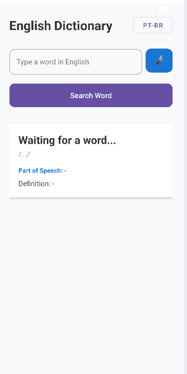
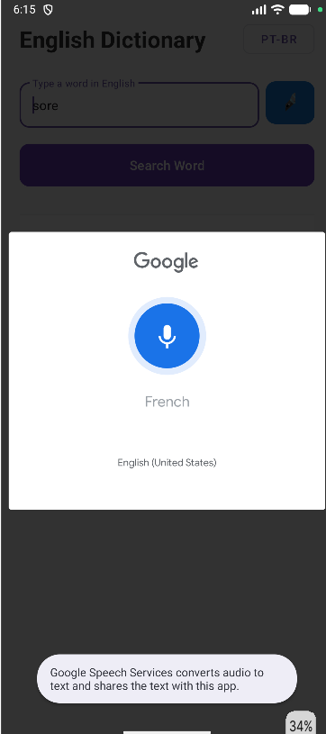
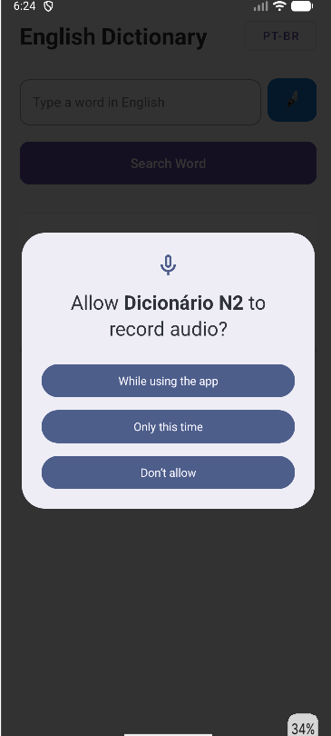
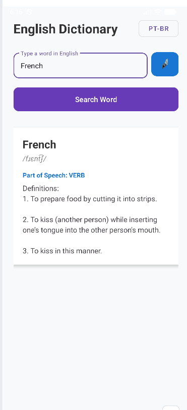

# English Dictionary — Versão com Permissão Android

## Descrição
Aplicativo mobile nativo de dicionário em inglês que consome uma API pública para consultas de vocabulário. Nesta versão, o app evoluiu para incluir uma funcionalidade de acessibilidade e conveniência: o reconhecimento de voz nativo do Android, permitindo buscar palavras através do microfone.

## Relação com a atividade anterior
A funcionalidade original do miniapp era realizar consultas textuais na *Free Dictionary API* e exibir os resultados estruturados na tela. Nesta etapa de evolução, foi adicionado um botão de gravação de voz que captura o áudio do usuário, transcreve para texto e preenche automaticamente o campo de busca, disparando a mesma requisição HTTP da versão anterior de forma perfeitamente integrada.

## API utilizada
- **Nome da API:** Free Dictionary API
- **Endpoint utilizado:** `https://api.dictionaryapi.dev/api/v2/entries/en/{word}`
- **Dados exibidos no app:** Nome da palavra, transcrição fonética, classe gramatical (Part of Speech) e até 3 definições numeradas.

## Permissão Android utilizada
- **Permissão escolhida:** `RECORD_AUDIO` (Microfone).
- **Onde ela foi declarada no Manifest:** Na raiz do arquivo `AndroidManifest.xml`, utilizando a tag `<uses-permission>`.
- trecho: `<uses-permission android:name="android.permission.RECORD_AUDIO" />`.
- **Por que essa permissão é necessária para o app:** Para utilizar o recurso `RecognizerIntent.ACTION_RECOGNIZE_SPEECH` da plataforma Android, que precisa escutar a voz do usuário em tempo real para transcrevê-la em texto e realizar a busca automatizada na API.
- **Em qual momento do fluxo ela é solicitada ao usuário:** A permissão é solicitada em tempo de execução (*runtime permission*) exata e exclusivamente quando o usuário clica no botão de microfone pela primeira vez.

## Fluxo da permissão
O aplicativo foi estruturado para tratar todos os cenários de decisão do usuário com total estabilidade:

1. **A permissão já foi concedida:** O app pula a etapa de verificação visual, abre direto o painel de escuta do Google e aguarda a fala do usuário.
2. **O usuário concede a permissão:** O app exibe um feedback de sucesso ("Permissão concedida!") e já aciona a gravação do microfone imediatamente, sem exigir novos cliques.
3. **O usuário nega a permissão:** O app intercepta a recusa sem causar fechamento inesperado (crash). Uma mensagem explicativa é exibida ("Microfone negado. Você ainda pode digitar."), e a interface continua 100% funcional para buscas tradicionais via teclado.

## Funcionalidades
- Consumo de API pública via método GET
- Validação de entrada de dados
- Funcionalidade avançada com permissão Android (Busca por voz)
- Tratamento de permissão concedida (Runtime Permission)
- Tratamento de permissão negada (Fallback seguro e UX)
- Exibição de feedback dinâmico ao usuário (Toasts e botões interativos)
- Troca de idioma da interface em tempo real via código

## Tecnologias utilizadas
- Kotlin
- Android Studio
- XML (Material Design Components)
- Biblioteca de requisição/API utilizada: Volley (JsonArrayRequest)
- Permissão Android escolhida: `android.permission.RECORD_AUDIO`

## Como executar o projeto
1. Clonar este repositório executando o comando no terminal:
   `git clone https://github.com/IanCorrea19/atividade-permissoes-mobile-ianvieira.git`
2. Abrir o projeto no Android Studio.
3. Aguardar a sincronização do Gradle.
4. Executar em emulador ou dispositivo físico. *(Atenção: No emulador, certifique-se de ativar o microfone no menu lateral em Extended Controls > Microphone > Enable Host Microphone Access).*
5. Testar a funcionalidade de API digitando uma palavra no campo de texto.
6. Testar a funcionalidade que solicita permissão clicando no botão do microfone e falando uma palavra em inglês, preenchendo o campo e consultando automaticamente após a fala.


## Solução de Problemas

**Erro de Build no Windows (Caracteres não-ASCII no caminho):**
Caso ocorra uma falha de compilação no Gradle com a mensagem `Your project path contains non-ASCII characters`, isso significa que o projeto foi clonado para uma pasta do Windows cujo caminho contém acentos ou caracteres especiais (ex: `C:\Users\Maria José\...`). O Gradle possui um bloqueio de segurança nativo para esses caminhos.

**Como resolver:**
* **Opção 1 (Recomendada):** Mova a pasta do projeto para um diretório limpo, sem espaços ou acentos no caminho (ex: `C:\ProjetosAndroid\`).
* **Opção 2 (Correção via código):** Abra o arquivo `gradle.properties` (na raiz do projeto) e adicione a seguinte flag na última linha para forçar o Gradle a ignorar o alerta:
  ```properties
  android.overridePathCheck=true

## Prints do aplicativo

### 1. Tela Inicial e Novo Layout


### 2. Solicitação da Permissão em Execução


### 3. Tratamento e Status das Permissões


### 4. Feedback e Resultado da Busca


Autor: Ian Vieira Corrêa -> Matrícula: 2589931
